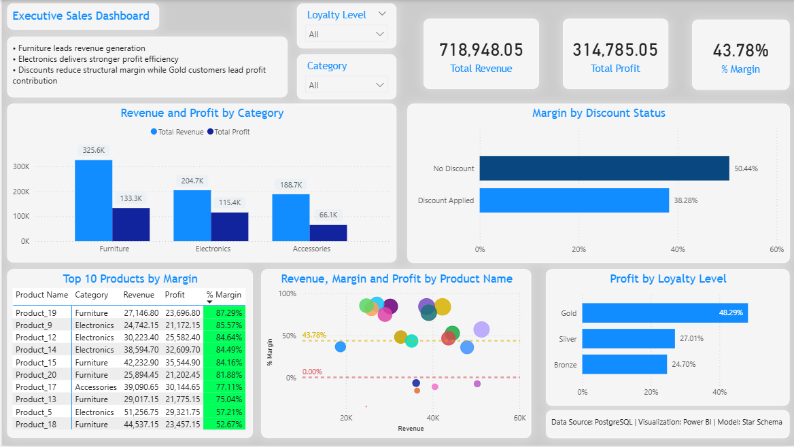

# Business Analysis SQL + Power BI


[English](#english) | [Español](#español)

# English
## 📸 Dashboard Preview


## Project Workflow

SQL → Analytical Views → Star Schema → Power BI Dashboard → Business Insights

## Tools Used

* PostgreSQL
* SQL
* Power BI
* Business Analysis

---
The dashboard was built using a star schema model, integrating PostgreSQL analytical views as fact and dimension tables to ensure scalable filtering and professional semantic modeling in Power BI.


## Project Objective

This project analyzes sales transactions to identify how categories, products, discounts, and customer loyalty impact revenue, profit, and margin.

The analysis focuses on transforming raw transactional data into actionable business insights through structured SQL exploration.

---

## Business Questions

* Which categories generate the highest revenue?
* Which categories are financially more efficient?
* How do discounts affect profitability?
* Which products create the strongest margin contribution?
* Which products generate losses?
* How does customer loyalty influence product profitability?

---

## Dataset Overview

Tables used in the project:

* `sales`
* `products`
* `customers`

Main business variables analyzed:

* `quantity`
* `unit_price`
* `discount`
* `cost`
* `category`
* `loyalty_level`

---

# Analysis Roadmap

## Day 1 — Data Understanding & Validation

Initial exploration focused on validating table consistency and identifying anomalies before starting business analysis.

### Main validations

* Null values detected in `discount`
* Null discounts treated as `0` using `COALESCE()` for revenue calculations
* Null discounts also preserved as a business anomaly for interpretation

### Key insight

Discount null records represented an important revenue share, so they were incorporated analytically instead of removed.

---

## Day 2 — Revenue, Profit & Discount Analysis

### Revenue by Category

Furniture showed the strongest commercial weight with multiple high-revenue products.

### Profit by Category

Electronics achieved the strongest profit efficiency despite lower revenue dominance.

### Margin by Discount Status

Discounted sales produced strong volume but lower efficiency:

* Discount Applied → **38.28% margin**
* No Discount → **50.44% margin**

### Strategic finding

Discounts increase commercial traction but materially reduce margin performance.

---

## Day 3 — Product & Customer Strategic Analysis

### Product Leaders

* Product_19 = highest portfolio margin (**87.29%**)
* Product_14 = strong premium profitability
* Product_15 = consistent cross-segment performance

### Profitability Alerts

* Product_7 = most critical negative margin (**-34.74%**)

### Customer Behavior

Gold customers generate the highest profit concentration in strategic products.

Bronze customers frequently achieve stronger margins in premium combinations.

---

# Executive Summary

Furniture leads revenue generation, while Electronics delivers stronger profit efficiency.  
Discount policies increase sales volume but materially reduce structural margin.  
Gold customers concentrate the highest profit contribution across strategic products.

---

# Business Recommendations

* Review discount policies in Furniture and Accessories
* Prioritize Product_19, Product_14 and Product_15 in strategic campaigns
* Reassess Product_7 pricing and cost structure
* Improve Silver segment conversion in high-margin products
* Replicate efficient Bronze purchasing patterns

---
# Business Impact

The project simulates how a business analyst transforms transactional data into strategic decisions:

- Identify profit leakage
- Optimize discount strategy
- Detect high-value products
- Improve customer profitability

# SQL Techniques Applied

* CTEs
* CASE WHEN
* COALESCE
* LEFT JOIN
* Views
* Aggregations
* Margin calculations
* Profit contribution analysis
* Customer segmentation

# Data Model Architecture

This project follows a star schema:

- Fact table: analytics_sales_base
- Dimension table: dim_products
- Dimension table: dim_customers

The analytical views were created in PostgreSQL and connected directly into Power BI for scalable reporting.

# Power BI Measures

Main DAX measures:

- Total Revenue
- Total Profit
- Margin %
- Profit Contribution %
---

# Repository Structure

```plaintext
Business-Analysis-SQL-POWER BI/
│── README.md
│── queries/
│   ├── day0_DDL.sql
│   ├── day1_data_validation.sql
│   ├── day2_profitability_analysis.sql
│   ├── day3_cross_tabulation_analysis.sql
│   ├── views.sql
│── dataset/
│   ├── sales.csv
│   ├── products.csv
│   ├── customers.csv
│── dashboard/
│   ├── Final Sales Analysis Performance Dashboard.pbix
│── images/
│   ├── dashboard-preview.png

```

---

# Project Value

This project demonstrates how SQL can be used not only to query data, but to support commercial interpretation and business decision-making.

## 👤 Author

Brandon Gomez Murcia  
Data Analyst | SQL | Power BI | DAX | Power Query

# Español
## 📸 Vista previa del panel de control


## Flujo de trabajo del proyecto

SQL → Vistas analíticas → Esquema en estrella → Panel de Power BI → Información empresarial

## Herramientas utilizadas

* PostgreSQL
* SQL
* Power BI
* Análisis de negocio

---
El panel de control se construyó utilizando un modelo de esquema en estrella, integrando vistas analíticas de PostgreSQL como tablas de hechos y dimensiones para garantizar un filtrado escalable y un modelado semántico profesional en Power BI.

## Objetivo del proyecto

Este proyecto analiza las transacciones de venta para identificar cómo las categorías, los productos, los descuentos y la fidelización de clientes impactan en los ingresos, las ganancias y el margen.

El análisis se centra en transformar los datos transaccionales brutos en información útil para la toma de decisiones empresariales mediante la exploración estructurada con SQL.

---

## Preguntas de negocio

* ¿Qué categorías generan los mayores ingresos?

* ¿Qué categorías son financieramente más eficientes?

* ¿Cómo afectan los descuentos a la rentabilidad?

* ¿Qué productos generan el mayor margen de beneficio?

* ¿Qué productos generan pérdidas?

* ¿Cómo influye la fidelización de clientes en la rentabilidad del producto?

---

## Resumen del conjunto de datos

Tablas utilizadas en el proyecto:

* `ventas`
* `productos`
* `clientes`

Principales variables de negocio analizadas:

* `cantidad`
* `precio_unitario`
* `descuento`
* `costo`
* `categoría`
* `nivel_fidelidad`

---

# Hoja de ruta del análisis

## Día 1: Comprensión y validación de datos

La exploración inicial se centró en validar la consistencia de las tablas e identificar anomalías antes de comenzar el análisis de negocio.

### Validaciones principales

* Se detectaron valores nulos en `descuento`.
* Los descuentos nulos se trataron como `0` utilizando `COALESCE()` para el cálculo de ingresos.
* Los descuentos nulos también se conservaron como una anomalía de negocio para su interpretación.

### Conclusiones clave

Los registros de descuento nulos representaban una parte importante de los ingresos, por lo que se incorporaron analíticamente en lugar de eliminarse.

---

## Día 2 — Análisis de Ingresos, Ganancias y Descuentos

### Ingresos por Categoría

El sector de Muebles mostró el mayor peso comercial, con múltiples productos de alta rentabilidad.

### Ganancias por Categoría

El sector de Electrónica logró la mayor eficiencia en las ganancias, a pesar de un menor dominio en los ingresos.

### Margen según el Estado del Descuento

Las ventas con descuento generaron un alto volumen, pero menor eficiencia:

* Descuento Aplicado → **38,28% de margen**

* Sin Descuento → **50,44% de margen**

### Conclusión Estratégica

Los descuentos aumentan la demanda comercial, pero reducen significativamente el margen de beneficio.

---

## Día 3 — Análisis Estratégico de Producto y Cliente

### Productos Líderes

* Producto_19 = mayor margen de cartera (**87,29%**)
* Producto_14 = alta rentabilidad premium
* Producto_15 = rendimiento consistente en todos los segmentos

### Alertas de Rentabilidad

* Producto_7 = margen negativo más crítico (**-34,74%**)

### Comportamiento del Cliente

Los clientes Oro generan la mayor concentración de ganancias en productos estratégicos.

Los clientes Bronce suelen obtener márgenes más altos en combinaciones premium.

---

# Resumen Ejecutivo

El mobiliario lidera la generación de ingresos, mientras que la electrónica ofrece una mayor eficiencia en las ganancias.
Las políticas de descuento aumentan el volumen de ventas, pero reducen significativamente el margen estructural.
Los clientes Gold concentran la mayor contribución a las ganancias en productos estratégicos.

---

# Recomendaciones comerciales

* Revisar las políticas de descuento en Muebles y Accesorios
* Priorizar los productos 19, 14 y 15 en campañas estratégicas
* Reevaluar el precio y la estructura de costos del producto 7
* Mejorar la conversión del segmento Plata en productos de alto margen
* Replicar patrones de compra eficientes del segmento Bronce

---
# Impacto en el negocio

El proyecto simula cómo un analista de negocios transforma los datos transaccionales en decisiones estratégicas:

- Identificar pérdidas de beneficios
- Optimizar la estrategia de descuentos
- Detectar productos de alto valor
- Mejorar la rentabilidad del cliente

---

# Técnicas SQL aplicadas

* CTE
* CASE WHEN
* COALESCE
* LEFT JOIN
* Agregaciones
* Cálculos de margen
* Análisis de contribución a las ganancias
* Segmentación de clientes

---

# Arquitectura del modelo de datos

Este proyecto sigue un esquema de estrella:

- Tabla de hechos: analytics_sales_base
- Tabla de dimensiones: dim_products
- Tabla de dimensiones: dim_customers

Las vistas analíticas se crearon en PostgreSQL y se conectaron directamente a Power BI para generar informes escalables.

---

# Medidas de Power BI

Principales medidas DAX:

- Ingresos totales
- Beneficio total
- Margen %
- Contribución al beneficio %

---

# Estructura del repositorio

```plaintext
Business-Analysis-SQL-POWER BI/
│── README.md
│── queries/
│   ├── day0_DDL.sql
│   ├── day1_data_validation.sql
│   ├── day2_profitability_analysis.sql
│   ├── day3_cross_tabulation_analysis.sql
│   ├── views.sql
│── dataset/
│   ├── sales.csv
│   ├── products.csv
│   ├── customers.csv
│── dashboard/
│   ├── Final Sales Analysis Performance Dashboard.pbix
│── images/
│   ├── dashboard-preview.png
```

---

# Valor del proyecto

Este proyecto demuestra cómo SQL puede utilizarse no solo para consultar datos, sino también para respaldar la interpretación comercial y la toma de decisiones empresariales.

---

## 👤 Autor

Brandon Gomez Murcia  
Data Analyst | SQL | Power BI | DAX | Power Query
